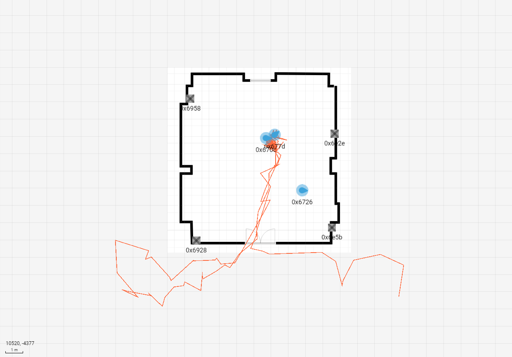
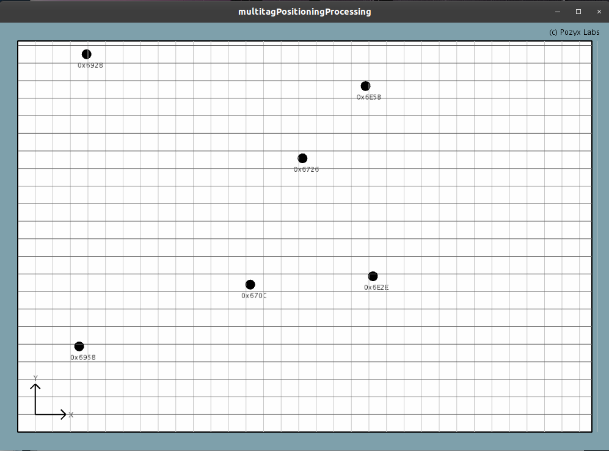

# Pozyx_FDI
Pozyx usage tests tailored for usage in 411's office of the Facultad de Informática of Universidad Complutense de Madrid. 

Initial configuration was made using Pozyx's cloud platform with auto calibrate function. We obtained the next map and ranges using max transmission power:


### Things you'll need:
* [Pozyx](https://www.pozyx.io/) Hardware
* [Arduino IDE](https://www.arduino.cc/en/Main/Software) or similar. I personally use [SublimeText3](https://www.sublimetext.com/3) with [Platformio](https://platformio.org/) alongside it. The platformio package for sublime is called Deviot.
* [Pozyx arduino library](https://github.com/pozyxLabs/Pozyx-Arduino-library)

## Multitag positioning
Based on the [tutorial 4](https://www.pozyx.io/Documentation/Tutorials/multitag_positioning) from Pozyx's website.
Once the anchors have been positioned burn the .ino to a compatible board that has a Pozyx tag connected. Start the .pde with Processing to begin the tracking.



---

## Max range 
The aim of this experiment is to test the maximum distance at which two given tags can communicate through UltraWideBand.

For this experiment the base boards are two SAMD21 based [Adafruit METRO M0 Express.](https://www.adafruit.com/product/3505)

Libraries:

* Adafruit NeoPixel library: ``` git clone git@github.com:adafruit/Adafruit_NeoPixel.git ```
* Adafruit_SPIFlash: ``` git clone git@github.com:adafruit/Adafruit_SPIFlash.git ```

---

## More info:
* Platformio docs on ATMELSAM - Add udev rules: http://docs.platformio.org/en/latest/platforms/atmelsam.html
* Adafruit udev rules: https://learn.adafruit.com/adafruit-arduino-ide-setup/linux-setup#udev-rules
* Using SPI 2MB memory https://learn.adafruit.com/adafruit-metro-m0-express-designed-for-circuitpython/using-spi-flash

Enjoy.