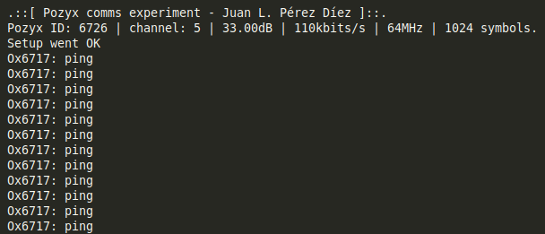

# Pozyx_FDI
[Pozyx](https://www.pozyx.io/) usage tests tailored for usage in office number 411 of the [Facultad de Informática](http://informatica.ucm.es/) of Universidad Complutense de Madrid. 

Initial configuration was made using Pozyx's cloud platform with auto calibrate function. For this we measured the Z position of all 4 anchors. The map was made using [Floorplanner.](https://www.floorplanner.com)


### Things you'll need:
* [Pozyx](https://www.pozyx.io/) Hardware
* [Arduino IDE](https://www.arduino.cc/en/Main/Software) or similar. I personally use [SublimeText3](https://www.sublimetext.com/3) with [Platformio](https://platformio.org/) alongside it. The platformio package for sublime is called Deviot.
* [Pozyx arduino library](https://github.com/pozyxLabs/Pozyx-Arduino-library)

For these experiments the base boards used were two SAMD21 based [Adafruit METRO M0 Express.](https://www.adafruit.com/product/3505)

#### Libraries:
If you're using platformio install them into ~/.platformio/lib

* Adafruit NeoPixel library: 
``` 
git clone git@github.com:adafruit/Adafruit_NeoPixel.git 
```
* Adafruit_SPIFlash: 
``` 
git clone git@github.com:adafruit/Adafruit_SPIFlash.git 
```
* Pozyx-Arduino-library 
``` 
git clone git@github.com:pozyxLabs/Pozyx-Arduino-library.git 
```

---

## Multitag positioning
Based on the [tutorial 4](https://www.pozyx.io/Documentation/Tutorials/multitag_positioning) from Pozyx's website.
Once the anchors have been positioned burn the .ino to a compatible board that has a Pozyx tag connected. Start the .pde with Processing to begin the tracking.


---
## UWB communications
This sketches demonstrate how UWB communications work between two Pozyx tags.
One acts as sender (communicationSender.ino) and broadcasts the message to all other devices. The other tag acts as a receiver (communicationReceiver.ino) and converts UWB messages to a serial output that can be read from a PC.

A typical output would be:



---

## Max range 
The aim of this experiment is to test the maximum distance at which two given tags can communicate through UltraWideBand.

---

## More info:
* If you have problems while detecting boards you need to add udev rules:
https://learn.adafruit.com/adafruit-arduino-ide-setup/linux-setup#udev-rules
``` 
$ wget https://raw.githubusercontent.com/adafruit/Trinket_Arduino_Linux/master/99-adafruit-boards.rules
$ sudo cp 99-adafruit-boards.rules /etc/udev/rules.d/   
```
http://docs.platformio.org/en/latest/faq.html#faq-udev-rules
```
$ curl -fsSL https://raw.githubusercontent.com/platformio/platformio-core/develop/scripts/99-platformio-udev.rules | sudo tee /etc/udev/rules.d/99-platformio-udev.rules
```

* [Platformio docs on ATMELSAM](http://docs.platformio.org/en/latest/platforms/atmelsam.html)
* [Using SPI 2MB memory](https://learn.adafruit.com/adafruit-metro-m0-express-designed-for-circuitpython/using-spi-flash)

---

Enjoy.